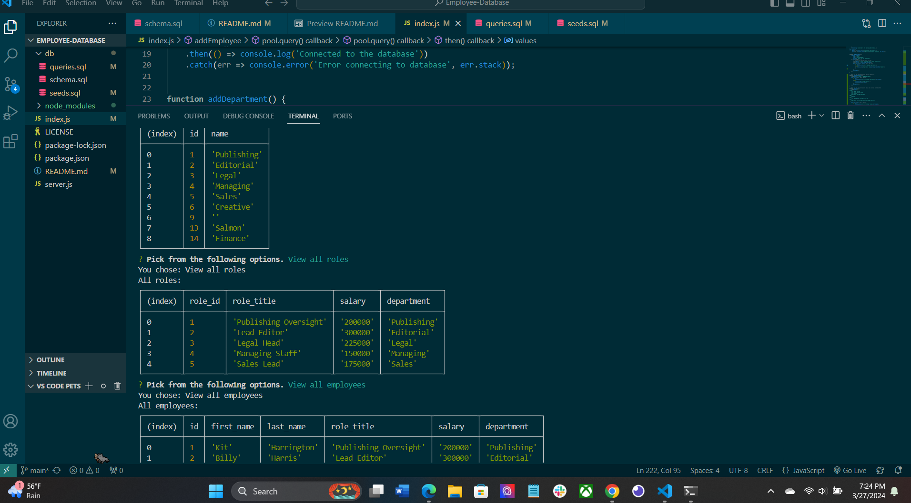

# Employee Database
 
  

## Description

This application takes employee information and organizes it into tables that you can add to or remove information from.

Walkthrough Video: [click me!](https://drive.google.com/file/d/1O7nwRAru1aZu33kKZ4NdF33NCanFb52f/view)

## Table of Contents

- [Description](#description)
- [Installation](#installation)
- [Usage](#usage)
- [License](#license)
- [Contributing](#contributing)
- [Tests](#tests)
- [Questions](#questions)

## Installation

You need to install inquirer@8.2.4 and the pg package.

## Usage

To use this application you just need to make sure the necessary packages are installed then enter your desired information when the prompt starts.

## License

This project is licensed under the MIT license.
## Contributing

N/A

## Tests

N/A

## Questions

For questions or feedback regarding this project, please contact me at JoAplon, through my [github](https://github.com/undefined), or my email, jordan0aplon@gmail.com.

